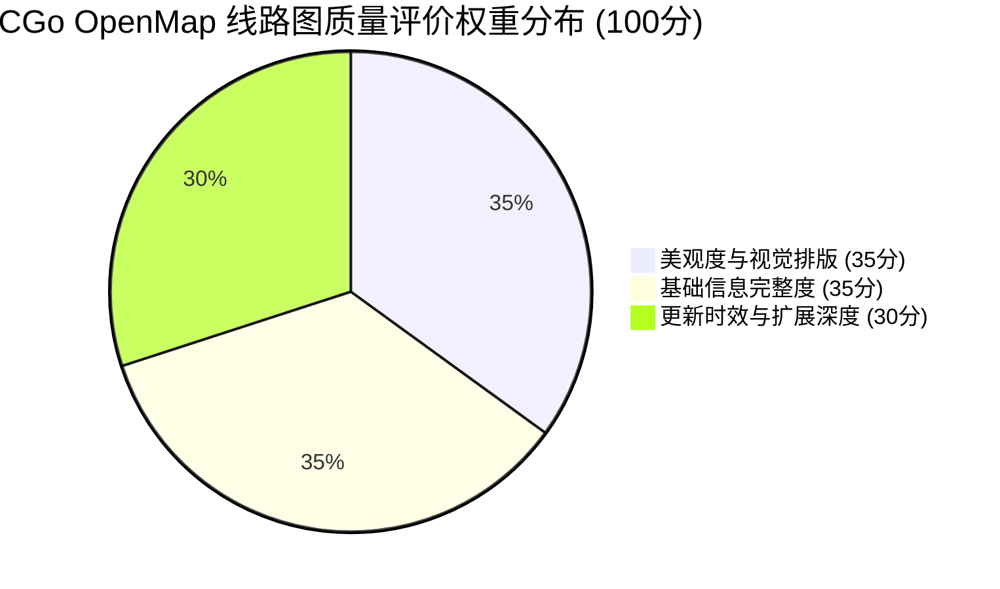

# 🏅 CGo OpenMap 线路图质量评定规范与治理方案 (Quality Standards & Governance Specification)

> **版本**：v1.0 (2026-10)  
> **适用范围**：CGo OpenMap 全网已收录城市、新申请准入城市、Drunk 导出工程及日常版本迭代审查。  
> **制定宗旨**：建立兼具**视觉艺术美感**、**工程拓扑严谨度**与**时效信息深度**的量化评价标准，确保各城市轨道交通交互线路图具备统一的高品质查阅体验，为城市主理人维护、社区贡献评审及下架流转治理提供客观依据。

---

## 一、 质量评价体系总览与权重分布

本规范采用**百分制综合评价模型**（总分 100 分），涵盖三大核心维度及十项具体指标：



| 一级维度 | 权重 | 核心考察方向 |
| :--- | :---: | :--- |
| **一、美观度与视觉排版 (Aesthetics & Typography)** | **35%** | 几何正交性、折角平滑、文字避让、色彩对比、双主题适配 |
| **二、基础信息完整度 (Data Completeness & Integrity)** | **35%** | 站名中英文规范、拓扑连通、换乘枢纽关系、站距里程真实性 |
| **三、更新时效与扩展深度 (Timeliness & Information Richness)** | **30%** | 运营变动响应时效、在建走向合理性、信息板特色模块覆盖率 |

---

## 二、 维度一：美观度与视觉排版标准（满分 35 分）

优秀的交通图不仅是数据载体，更是城市视觉工程的艺术品。

### 1.1 拓扑正交性与几何规整度（10 分）
- **【红线】统一斜线角度体系（严禁多段短直线拼接拟合曲线）（4分）**：
  - **角度统一性**：全网斜线倾角必须体系化统一步调。例如北京等线网严格遵循标准 45° 正交系统；即便部分城市因地理特殊性自定义特定倾角（如沈阳等），该城市全网同一方向的斜线也必须严格统一步调，杜绝同一张图内斜率杂乱无章；
  - **严禁直线碎步拼接伪模拟曲线**：**严禁将多段短直线碎步拼接以试图制造“近似曲线”的伪弧线效果**！这种做法严重违背交通图拓扑美学，在正交与准正交制图规范中属于完全不合格的残次画法；
  - **标准倒角实现平滑过渡**：任何方向变换与拐角必须且只能由折点处的几何倒角圆弧（由引擎 `core/path-geometry.js` 统一倒角半径，直角推荐 `18px`，斜角推荐 `8px`）规范渲染，杜绝折点抖动与多边形碎拼。
- **【强制】正交网格吸附与折角倒角规范（3分）**：
  - 线路走向必须严格吸附于 0°/45°/90° 正交网格，严禁出现未经吸附的 3°~10° 细微手滑歪斜或锯齿状微小偏移；
  - 密集换乘区或极短折线段必须启用 `useStrictRounding: true` 或指定局部圆角 `r`，杜绝圆角过度重叠造成的破角与折线畸变。
- **【强制】平行共线段间距匀称（3分）**：
  - 多条线路平行穿行或共线区段，线间距（Margin）必须恒定，弯道转弯处必须呈规整同心圆弧，严禁忽宽忽窄或交叉重叠穿刺。

### 1.2 文字避让与排版呼吸感（10 分）
- **【红线】严禁站名文字压线与重叠（零压线放置准则）（4分）**：
  - **严禁压线放置**：站名文字（中文与英文）严禁直接骑跨、横贯或压在轨道线上放置，站名必须位于轨道线条外部净空区域；
  - **图元与标签零遮挡**：站名标签严禁遮挡换乘胶囊、换乘图元或相邻站名，相邻站点的文字标签必须保持清晰的安全间距；
  - 凡是出现站名文字直接压在轨道线上的，属于严重排版事故，一票否决。
- **【强制】对齐锚点（Align）合理性（3分）**：
  - 正确使用 8 方向锚点（`top`、`bottom`、`left`、`right`、`top-left`、`top-right`、`bottom-left`、`bottom-right`）；
  - 同一走向的连续站点应保持文字锚点逻辑一致性（如线路西侧一律向左对齐），避免左右毫无规则地反复蛇形跳变。
- **【体验】微距偏移（Offset）与长站名排版（3分）**：
  - 站名文字与站点圆点/胶囊保持 `4~8px` 呼吸空隙（通过 `offset: { x, y }` 精准调校），避免文字悬空过远导致归属混乱；
  - 超长站名（超过 6 个汉字或 20 个英文字符）合理配置换行或 `textScale`，保持全图字号节奏均衡。

### 1.3 图元规范与视觉层次（10 分）
- **【准入门槛】基准底线：必须达到或超越官方线路图标准（3分）**：
  - CGo OpenMap 的成果底线是**至少达到各城市轨道交通官方正式发布的权威线网图专业美学标准，或者更优**；
  - 若在几何规整度、文字避让、色彩还原或排版专业度上明显劣于官方线网图，属于不合格成果，拒绝收录或限期整改。
- **【标准】标准站点图元与走向（3分）**：
  - 严格使用项目标准：`dot`（普通地下/高架站）、`tsf`（换乘枢纽）、`rdot`（国铁火车站/枢纽）、`no`（暂缓开通/在建未通车站），严禁滥用类型；
  - 国铁与城际铁路若跨越全城且无连续地铁走向，须声明 `isPointOnly: true`，禁止按序号直连拉出横穿全图的飞线。
- **【色彩】色彩权威性与无障碍对比（2分）**：
  - 线路标志色必须 100% 对应城市官方最新发布的标准色卡 Hex 值；
  - 色彩饱和度与明度适中，白底与黑底下均清晰可读，符合 Web 无障碍对比度（WCAG AA 3:1+）要求；
  - 邻近线路色彩必须具有显著辨识度，严禁两条色值极其相近的线路在无换乘标识的情况下平行动行引发混淆。
- **【结构】画布构图与重心平衡（2分）**：
  - 城市主城区线网居于视口重心，边缘郊区线路走向收放自然，四周留白（Padding）适中；
  - `mapSize` 画布尺寸设定合理，无冗余无意义的超大空白区域。

### 1.4 双主题（亮/暗模式）适配（5 分）
- **【强制】全局深浅色自动适配（3分）**：
  - 站点边框、站名文字、底图水系、换乘外圈在亮色模式（白天）与暗色模式（夜间）下均自然切换，无反色异常；
  - 严禁在车站或线路数据中硬编码固定文字背景色导致暗色模式下发白刺眼。
- **【体验】高分辨率 Retina 屏清晰度（2分）**：
  - 矢量 SVG 渲染精准无发虚，移动端缩放至 2.5x 以上时文字无撕裂或毛刺。

---

## 三、 维度二：基础信息完整度标准（满分 35 分）

基础数据是交互式地图的灵魂，任何错别字与缺失都会误导乘车用户。

### 2.1 站名与多语言规范性（10 分）
- **【准确】中文站名 100% 准确（4分）**：
  - 中文站名必须与官方运营单位最新车站名牌完全一致；
  - 严格校对生僻字、多音字以及括号后缀命名规范（如 `(南)`、`(XX校区)` 等括号全半角统一为半角括号或官方规范）；
  - 严禁使用民间俗称或非官方规划工程代号替代正式开通站名。
- **【国际化】英文/拼音规范化（3分）**：
  - 英文站名必须符合当地城市官方标准（区分通用名缩写规范，如 `Railway Station`、`Road / Rd`、`Street / St`、`Ave`、`Park` 等）；
  - 拼音分词、空格与大小写严谨（如首字母大写、双字拼音连写等），杜绝低级拼写笔误。
- **【检索】拼音与别名检索库（3分）**：
  - 提供城市对应的快速拼音索引（如 `staname.csv` 或别名映射表），支持首字母拼音（如 `RMGQ` 快速定位人民广场）及历史曾用名模糊检索。

### 2.2 拓扑关系与连通性完整度（10 分）
- **【结构】站点 ID 与线网定义规范（3分）**：
  - 车站 ID 具全局唯一性，命名清晰（如 `M101`、`S101` 等带线路前缀格式）；
  - 线路定义必须包含 `id`、`name`、`color`、`company` 等关键元数据。
- **【拓扑】复杂走向与分支支持（4分）**：
  - 环线必须正确声明 `isLoop: true`；
  - Y 型分支或多支线线路必须正确声明 `hasbranch: true` 并规范填充 `stationIds-way1`、`stationIds-way2`；
  - 走向折点（`pathPoints`）拐弯逻辑与站序顺序严格对应。
- **【工程】站距与里程数据严谨度（3分）**：
  - 站间距数组（`distances`）必须严格真实，单位为米（m）；
  - 数组长度必须满足严格几何关系：
    - 普通单线：`distances.length === stationIds.length - 1`；
    - 闭合环线：`distances.length === stationIds.length`；
    - 分支线路：各支线 `distances-wayN` 长度与各分支车站数组严格匹配。

### 2.3 换乘体系与综合枢纽（10 分）
- **【枢纽】同台/通道换乘准确性（4分）**：
  - 物理换乘站（共站）必须共用相同车站 ID 与坐标，或图元正确体现相交融合；
  - 避免将两条相隔较远的车站错误连成单点换乘，避免遗漏真实存在的十字/T型换乘节点。
- **【虚拟换乘】出站地面换乘（3分）**：
  - 针对出站限时免费换乘或非付费区通道换乘，提供 `data_virtual_transfers.js` 映射；
  - 明确标注换乘类型（虚拟出站连通）、步行距离及有效时间约束。
- **【大交通】大交通枢纽联动（3分）**：
  - 机场航站楼（Terminal）、高铁干线火车站、客运码头等核心枢纽属性完备；
  - 正确关联国铁线路或机场快轨，徽章与图标调用标准 CGoUI 组件。

### 2.4 图例与检索体系（5 分）
- **【清晰】图例分组架构（3分）**：
  - `data_legend.js` 分组科学合理，按不同制式层次分明（如：城市地铁、市域快线、有轨电车、磁浮线、在建工程等）；
  - 允许用户按线分类筛选与折叠。
- **【徽标】线路矢量徽标（2分）**：
  - 复用标准 `assets/svg/icon@*.svg` 模板或规范注入配色变量，图例展示精致统一。

---

## 四、 维度三：更新时效与扩展深度标准（满分 30 分）

城市线网持续演进，优秀的线路图离不开时效性与信息密度的双重深耕。

### 3.1 时效性与动态响应（10 分）
- **【时效】新线开通与重大变动响应（5分）**：
  - 新线路/新延伸段开通运营、车站更名或区间停运，响应跟进周期要求：
    - ⚡ **优秀（5分）**：官方开通通告发布或正式开通后 **72 小时内** 提交更新 PR；
    - ⚠️ **合格（3分）**：**15 天内** 提交更新 PR；
    - ❌ **严重滞后（0分）**：超过 **30 天** 无人响应维护，直接触发质量预警。
- **【在建】在建与规划线网真实性（5分）**：
  - 包含在建与规划虚线（`data_notopen.js`）；
  - 走向与官方发改委批复规划吻合，虚线排版美观，与既有路网过渡自然，无凭空捏造走向。

### 3.2 车站信息板特色模块深度（10 分）
根据 [《车站信息板自定义模块开发指南》](file:///Users/liuzihan/Documents/GitHub/CGo-OpenMap/docs/STATION_MODULE_GUIDE.md)，考察城市业务模块的深度建设：

- **【时刻】首末班车时刻表（3分）**：
  - 具备 `data_timetable.js`，包含全线网各站首末班车时间（工作日/周末不同方向发车点）。
- **【文旅】城市特色文旅与地标导览（2分）**：
  - 收录车站周边历史名胜古迹、5A/4A景区、重要文博商圈导览（如北京历史文旅、沈阳方城特色等）。
- **【换乘】立体换乘与深度指引（2分）**：
  - 提供换乘通道形式（同台/十字/通道/出站）、步行预估耗时及无障碍路线指引。
- **【接驳】地面微循环出行与设施（3分）**：
  - 提供地面公交接驳、火车站/客运站无缝接驳、站台形式（岛式/侧式）或母婴室/AED便民设施指引。

### 3.3 工程规范与代码健康度（10 分）
- **【纯前端】严格遵守纯前端最高铁律（4分）**：
  - 100% 纯原生 JavaScript (ES6+)、CSS3 与 SVG，零外部服务端进程（严禁使用 Node.js 后端/PM2 管理/React/Vue 框架及打包编译工具）；
  - 控制台干净无报错，严格遵循单文件与静态部署开箱即用原则。
- **【自检】通过自动化回归自检（3分）**：
  - 必须通过 `node drunk/tools/selfcheck.js` 或数据完整性自检；
  - 站距与车站数量完全对应、无悬空未定义站点 ID、无语法错误。
- **【规范】缓存更新与图标规范（3分）**：
  - PR 同步更新 `sw.js` 缓存版本，避免强缓存失效；
  - 界面与模块严禁滥用 Emoji，所有图标强制使用 `<cgo-icon>` 原生矢量组件。

---

## 五、 质量评级体系与量化阈值

依据综合得分（100 分制），城市线路图划分为五个质量等级：

```text
  ┌─────────────────────────────────────────────────────────────┐
  │ 🌟 S 级 (90 ~ 100 分) : 标杆示范城市 (官方推荐，金色徽章)    │
  │ ─────────────────────────────────────────────────────────── │
  │ 🟢 A 级 (80 ~ 89 分)  : 优质成熟城市 (正常公开展示与收录)    │
  │ ─────────────────────────────────────────────────────────── │
  │ 🟡 B 级 (70 ~ 79 分)  : 合格可读城市 (上线展示，限期补充)    │
  │ ─────────────────────────────────────────────────────────── │
  │ 🟠 C 级 (60 ~ 69 分)  : 预警观察城市 (下发整改，限期 14 天)  │
  │ ─────────────────────────────────────────────────────────── │
  │ 🔴 D 级 (< 60 分)     : 下架整改城市 (隐藏下架，主理人流转)  │
  └─────────────────────────────────────────────────────────────┘
```

### 等级定义与运维权益

| 评级 | 综合得分 | 平台状态 | 治理规则与权益 |
| :---: | :---: | :---: | :--- |
| **S 级（标杆示范）** | **90 ~ 100** | 首页重点推荐 | • 授予“标杆城市主理人”金色徽章与长期署名；<br>• 作为新城市移植的官方参考范式；<br>• 核心团队优先支持定制专属图形特效。 |
| **A 级（优质成熟）** | **80 ~ 89** | 正常展示 | • 线路走向规整、文字无遮挡、中英文严谨、通过全部自检；<br>• 稳定维护，主理人享有完全治理审核权。 |
| **B 级（合格可用）** | **70 ~ 79** | 正常展示 | • 核心线路与站点完整，但缺少特色信息板模块（如暂无时刻表）；<br>• 鼓励在接下来的版本中持续充实。 |
| **C 级（预警观察）** | **60 ~ 69** | 限制展示 / 标记观察 | • 出现文字压线、个别站距不符或开通新线超过 15 天未更新；<br>• 官方在 QQ 交流群下发整改清单，限期 14 天内提交修复 PR。 |
| **D 级（下架整改）** | **< 60** | **首页下架 / 隐藏维护** | • 数据严重滞后（超 30 天未跟进重大变动）、排版严重混乱交叉重叠、或长期无法联络原主理人；<br>• **首页卡片执行下架隐藏**（保留代码与底层路由）；<br>• **主理人席位开放流动交接**，社区贡献者可提交 A 级重构方案接替。 |

---

## 六、 城市生命周期与主理人流转治理方案

为了杜绝“一人占坑、长期废弃、用户受损”的开源痛点，项目实行严格而透明的动态流转治理机制：

```mermaid
flowchart TD
    A[城市正常上线运行 (S/A/B级)] -->|新线开通 / 数据缺陷| B{主理人是否在规定时限维护?}
    B -- 是 (提交达标PR) --> A
    B -- 否 (超时无响应 / 质量倒退) --> C[触发 C 级质量预警]
    C -->|官方QQ群公示 & 限期14天| D{是否完成整改?}
    D -- 是 --> A
    D -- 否 --> E[降为 D 级: 执行下架隐藏处理]
    E --> F[原主理人席位进入暂保保留期]
    F --> G{处置分支}
    G -- 原主理人提交合格更新 --> H[恢复上线并续期主理人资格]
    G -- 社区新贡献者率先提交 A 级重构 PR --> I[主理人席位正式移交转接新贡献者]
    H --> A
    I --> A
```

### 1. 预警与整改流程
1. **缺陷巡检**：官方核心团队或社区用户通过 Issue / 巡检脚本发现城市存在评级跌入 C 级或 D 级的情形；
2. **群内公示通知**：官方在 **官方 QQ 交流群（群号：619357751）** 发出 `@` 提醒与整改通知书，列明具体缺陷指标（如：文字遮挡清单、站距失配项、新线缺失项）；
3. **14 天宽限期**：原主理人享有 14 天优先整改期。

### 2. 下架隐藏机制（Delisting）
- 若 14 天宽限期满仍未修复，或数据严重滞后超过 30 天：
  - 城市在 `city/data.js` 中标记为 `status: "delisted"`, `hidden: true`；
  - 门户首页（`index.html`）隐藏该城市卡片，避免误导普通乘车乘客；
  - 完整保留 `city/{city_id}/` 源码及直接路由（`main.html?city={city_id}`），保障开源成果不被物理抹杀。

### 3. 主理人席位保全与交接规则
- **席位保全期**：城市下架后，原主理人署名与席位暂时保留，只要原主理人重新提交达到 A 级标准的有效更新 PR，即可解除下架恢复上线，席位继续续期。
- **社区接替原则**：在下架维护期间，若原主理人无暇维护，且社区中出现积极接手整改、攻坚修复存量缺陷、深度重构数据并达到 **A 级以上品质** 的新贡献者，官方核心团队将批准合入新方案，**该城市的主理人身份、治理权限与官方名录署名将依规正式流转交接给新任维护者**。

### 4. 典型治理案例剖析（以合肥线网为例）
合肥线网（`city/hefei/`）作为首个触发质量治理并执行下架维护的实例，具体判定原因与整改要点如下：
- **缺陷 1：站名文字压线放置** —— 部分车站站名文字直接横跨、覆盖在轨道线条上方，违反了文字避让的红线准则；
- **缺陷 2：使用短直线拼接伪模拟曲线** —— 部分弯道拐角处，采用了连续多段细碎小折线逐段拼接以试图模仿弧线效果，破坏了正交网格的几何纯粹性与引擎统一倒角渲染；
- **缺陷 3：斜线角度缺乏系统统合** —— 斜线倾角各异，未遵循统一的 45° 或城市统一度数体系，整体视觉质感低于合肥轨道交通官方正式线路图标准；
- **处置方案**：暂时从首页门户中隐藏下架；完整保留底层数据与直接路由（`main.html?city=hefei`）；主理人席位进入保全期，等待原主理人或社区贡献者依照本规范进行正交化与排版重构，达标后方可重新上架。

---

## 七、 评估实操自检表（提交 PR 前必须对照）

贡献者与审阅人可使用以下表格进行快速打分与自检：

```markdown
### 📋 线路图质量评审打分表
城市名称: _____________    评审人: _____________    日期: _____________

[维度一: 美观度与视觉排版 (满分 35)]
- [ ] 1.1 走向严格符合 0°/45°/90° 正交网格，倒角平滑无尖锐破角 (___/10)
- [ ] 1.2 站名文字 100% 避让线路与图元，无任何遮挡与重叠，锚点合理 (___/10)
- [ ] 1.3 站点图元规范，官方色谱准确，国铁/机场使用 isPointOnly/正确图元 (___/10)
- [ ] 1.4 深色与浅色双模式完美自适应，高分屏清晰无毛刺 (___/5)

[维度二: 基础信息完整度 (满分 35)]
- [ ] 2.1 站名中英文规范严谨，无错别字与机翻，配备快速检索支持 (___/10)
- [ ] 2.2 拓扑逻辑严谨，环线/分支配置正确，站距数组与站数严格匹配 (___/10)
- [ ] 2.3 换乘站连通正确，大交通枢纽完备，支持出站虚拟换乘映射 (___/10)
- [ ] 2.4 图例分类清晰科学，线路徽标显示完整 (___/5)

[维度三: 更新时效与扩展深度 (满分 30)]
- [ ] 3.1 最新开通线路/车站无遗漏，在建线路走向权威可靠 (___/10)
- [ ] 3.2 接入车站信息板模块 (首末班车时刻 / 文旅导览 / 换乘详情 / 接驳设施) (___/10)
- [ ] 3.3 严格遵循纯前端大前提，控制台零报错，通过 selfcheck.js 自动化自检 (___/10)

======================================================================
★ 综合得分: _____ 分    评定等级: [ ] S级  [ ] A级  [ ] B级  [ ] C级  [ ] D级
评审结论: [ ] 建议直接合并  [ ] 需按建议整改  [ ] 暂缓上线
```

---

> 💡 **项目最终解释权说明**：本评定规范与流转机制旨在维护开源成果的长青与公信力，规范细则由 CGo OpenMap 官方核心团队持续迭代完善并保留最终解释权。
