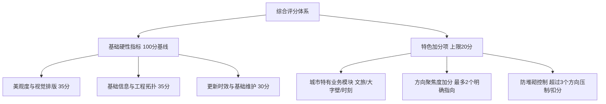

# 🏅 CGo OpenMap 线路图质量评定规范与治理方案 (Quality Standards & Governance Specification)

> **版本**：v1.2 (2026-10)  
> **适用范围**：CGo OpenMap 全网已收录城市、新申请准入城市、Drunk 导出工程及日常版本迭代审查。  
> **制定宗旨**：建立兼具**视觉艺术美感**、**工程拓扑严谨度**、**空间利用效率**与**信息特色深度**的量化评价标准，确保各城市轨道交通交互线路图具备统一的高品质查阅体验，为城市主理人维护、社区贡献评审及下架流转治理提供客观依据。

---

## 一、 质量评价体系总览与评分模型

本规范采用**「基线扣分制（硬性基石）+ 特色加分制（城市创新）+ 方向聚焦度控制」**的综合评价架构（基准总分 100 分，上限 120 分）：



### 1. 评分机制核心设计原则
1. **`core/` 核心功能与基础数据：严格实行「基线扣分制」**：
   - 涉及核心引擎（`core/`）运行与全站交互的硬性基础数据（如站间距 `distances`、物理/地理坐标、站点 ID 闭合性、注册表 `city/data.js` 关键元数据），先赋予满分基准，**缺少一项或格式违规即按项严格扣分**。
2. **`city/` 城市专属扩展目录：实行「特色加分制」**：
   - 各城市目录（`city/{city_id}/`）根据本地文脉与运营特征实现的特色功能（如文化旅游导览、名胜地标、车站大字壁书法艺术、建设历史档案等），按实际质感与体验给予加分奖励。
3. **方向聚焦度与防冗余堆砌原则（Anti-Clutter Principle）**：
   - 线路图必须具有明确清晰的定位指向（旅客服务导向 vs 工程规划导向）；
   - **聚焦 1~2 个方向且做深做透者高额加分**；
   - **严禁盲目贪多堆砌**：方向超过 3 个、多而杂乱导致信息喧宾夺主者，严格限制加分，甚至扣减排版呼吸分。

---

## 二、 维度一：美观度与视觉排版标准（基准 35 分）

优秀的交通图不仅是数据载体，更是城市视觉工程的艺术品。

> 💡 **核心美学基本原则（设计自由度与审美底线）**：  
> **「你可以不用已有的既定标准，但你自己的标准必须美观！」**  
> CGo OpenMap 鼓励主理人探索符合本城地理特征的排版风格（不强制完全照搬北京的 45° 模式或已有城市的走线范式），但无论选择何种线条形态，**自创的标准必须具备极高的自洽性、几何协调感与严谨的专业美感**。严禁以“个性化自由发挥”为借口，产出粗糙随意、拼接失调、毫无秩序感的劣质走线。

### 1.1 拓扑正交性与几何规整度（8 分）
- **【红线】统一斜线角度体系（严禁多段短直线拼接拟合曲线）（3分）**：
  - **角度统一性**：全网斜线倾角必须体系化统一步调。例如北京等线网严格遵循标准 45° 正交系统；即便部分城市因地理特殊性自定义特定倾角（如沈阳等），该城市全网同一方向的斜线也必须严格统一步调，杜绝同一张图内斜率杂乱无章；
  - **严禁直线碎步拼接伪模拟曲线**：**严禁将多段短直线碎步拼接以试图制造“近似曲线”的伪弧线效果**！这种做法严重违背交通图拓扑美学，在正交与准正交制图规范中属于完全不合格的残次画法；
  - **标准倒角实现平滑过渡**：任何方向变换与拐角必须且只能由折点处的几何倒角圆弧（由引擎 `core/path-geometry.js` 统一倒角半径，直角推荐 `18px`，斜角推荐 `8px`）规范渲染，杜绝折点抖动与多边形碎拼。
- **【强制】正交网格吸附与折角倒角规范（3分）**：
  - 线路走向必须严格吸附于 0°/45°/90° 正交网格，严禁出现未经吸附的 3°~10° 细微手滑歪斜或锯齿状微小偏移；
  - 密集换乘区或极短折线段必须启用 `useStrictRounding: true` 或指定局部圆角 `r`，杜绝圆角过度重叠造成的破角与折线畸变。
- **【强制】平行共线段间距匀称（2分）**：
  - 多条线路平行穿行或共线区段，线间距（Margin）必须恒定，弯道转弯处必须呈规整同心圆弧，严禁忽宽忽窄或交叉重叠穿刺。

### 1.2 文字避让与排版呼吸感（8 分）
- **【红线】严禁站名文字压线与重叠（零压线放置准则）（3分）**：
  - **严禁压线放置**：站名文字（中文与英文）严禁直接骑跨、横贯或压在轨道线上放置，站名必须位于轨道线条外部净空区域；
  - **图元与标签零遮挡**：站名标签严禁遮挡换乘胶囊、换乘图元或相邻站名，相邻站点的文字标签必须保持清晰的安全间距；
  - 凡是出现站名文字直接压在轨道线上的，属于严重排版事故，一票否决。
- **【强制】对齐锚点（Align）合理性（3分）**：
  - 正确使用 8 方向锚点（`top`、`bottom`、`left`、`right`、`top-left`、`top-right`、`bottom-left`、`bottom-right`）；
  - 同一走向的连续站点应保持文字锚点逻辑一致性（如线路西侧一律向左对齐），避免左右毫无规则地反复蛇形跳变。
- **【体验】微距偏移（Offset）与长站名排版（2分）**：
  - 站名文字与站点圆点/胶囊保持 `4~8px` 呼吸空隙（通过 `offset: { x, y }` 精准调校），避免文字悬空过远导致归属混乱；
  - 超长站名（超过 6 个汉字或 20 个英文字符）合理配置换行或 `textScale`，保持全图字号节奏均衡。

### 1.3 空间利用率、排版紧凑度与全局缩放可读性（8 分）
- **【核心】严禁大面积无效空白与松散拉跨（3分）**：
  - 未经严谨推敲的线路图往往站间距盲目拉得极大，造成全图存在大量空洞空白、结构松散松垮；
  - 优秀的交通图必须**充分、合理地运用图面空间与空隙，不浪费画布每一寸视口**。以**北京线网**为行业标杆，经过极其严谨的拓扑工程设计，主城区与外围每一个空隙都被合理穿插与利用，全网紧凑充实、密度均衡，绝无突兀的大片荒漠。
- **【关键】全图概览缩放（Zoom-out）文字可读性（3分）**：
  - **检验空间规划的核心试金石**：当用户将线路图缩小到全景视图（以看清全网概貌）时，关键换乘站与主要站名文字**依然必须能够清晰辨认**；
  - 若因空间排版松散、空白巨大，导致全图被强制极度缩小，使文字缩成无法阅读的微弱噪点，属于排版空间规划不达标。
- **【节奏】全图重心平衡与疏密节奏（2分）**：
  - 核心城区密集换乘区的适度紧凑，与郊区延伸线、市域线的舒展延伸保持自然的比例过渡，画布四周边距（Padding）匀称，全图视觉重心沉稳扎实。

### 1.4 图元规范、色彩权威性与官方基准（6 分）
- **【准入门槛】基准底线：必须达到或超越官方线路图标准（2分）**：
  - CGo OpenMap 的成果底线是**至少达到各城市轨道交通官方正式发布的权威线网图专业美学标准，或者更优**；
  - 若在几何规整度、文字避让、色彩还原或排版专业度上明显劣于官方线网图，属于不合格成果，拒绝收录或限期整改。
- **【标准】标准站点图元与走向（2分）**：
  - 严格使用项目标准：`dot`（普通地下/高架站）、`tsf`（换乘枢纽）、`rdot`（国铁火车站/枢纽）、`no`（暂缓开通/在建未通车站），严禁滥用类型；
  - 国铁与城际铁路若跨越全城且无连续地铁走向，须声明 `isPointOnly: true`，禁止按序号直连拉出横穿全图的飞线。
- **【色彩】色彩权威性与无障碍对比（2分）**：
  - 线路标志色必须 100% 对应城市官方最新发布的标准色卡 Hex 值；
  - 色彩饱和度与明度适中，白底与黑底下均清晰可读，符合 Web 无障碍对比度（WCAG AA 3:1+）要求；
  - 邻近线路色彩必须具有显著辨识度，严禁两条色值极其相近的线路在无换乘标识的情况下平行动行引发混淆。

### 1.5 双主题（亮/暗模式）适配（5 分）
- **【强制】全局深浅色自动适配（3分）**：
  - 站点边框、站名文字、底图水系、换乘外圈在亮色模式（白天）与暗色模式（夜间）下均自然切换，无反色异常；
  - 严禁在车站或线路数据中硬编码固定文字背景色导致暗色模式下发白刺眼。
- **【体验】高分辨率 Retina 屏清晰度（2分）**：
  - 矢量 SVG 渲染精准无发虚，移动端缩放至 2.5x 以上时文字无撕裂或毛刺。

---

## 三、 维度二：基础信息完整度与工程规范（基准 35 分，基线扣分制）

基础数据是交互式地图的灵魂，`core/` 引擎依赖的底层数据必须严谨无误。

### 2.1 站名规范与多语言检索库（10 分）
- **【准确】中文站名 100% 准确（4分）**：与官方最新名牌完全一致，校对生僻字、多音字及副站名括号规范，发现错字/别字扣分。
- **【国际化】英文/拼音规范化（3分）**：符合官方译名体系（缩写如 `Railway Station`、`Rd` 规范），拼音分词正确，发现机翻/拼写错误扣分。
- **【检索】拼音与别名检索库（3分）**：提供城市拼音索引（`staname.csv`），支持首字母拼音与历史更名检索。缺少检索库扣 2 分。

### 2.2 核心工程拓扑与硬性数据完整性（10 分）
- **【硬性】站间距数据（`distances`）严格匹配（4分）**：
  - 站距数组必须真实有效，数组长度严格满足几何校验规则：
    - 普通单线：`distances.length === stationIds.length - 1`；
    - 闭合环线：`distances.length === stationIds.length`；
    - 分支线路：各分支距离数组严格匹配各分支站点数。
  - **扣分规则**：缺失站距数据直接扣 4 分，长度失配每条线路扣 1 分。
- **【拓扑】运行拓扑与站点 ID 规范（3分）**：
  - 车站 ID 全局唯一且闭合；环线声明 `isLoop: true`；分支声明 `hasbranch: true` 与 `way1/way2`。出现断链或悬空未定义 ID 扣分。
- **【地理】中心点与视口尺寸坐标（3分）**：
  - 城市配置中的 `center: { x, y }`、`defaultScale`、`mapSize` 必须真实有效，确保初次打开精准居中。未配置或坐标偏移扣分。

### 2.3 换乘体系与大交通枢纽（10 分）
- **【枢纽】物理换乘准确性（4分）**：共站换乘共用坐标与 ID，图元正确融合，无遗漏换乘节点。
- **【虚拟换乘】出站连通映射（3分）**：存在虚拟出站换乘的城市，需提供 `data_virtual_transfers.js` 标明换乘距离与时效。
- **【交通枢纽】大交通联动（3分）**：机场、高铁火车站等交通枢纽属性完整，图标调用标准 CGoUI 组件。

### 2.4 图例与索引体系（5 分）
- **【清晰】图例分组（3分）**：`data_legend.js` 分类清晰科学，支持按制式筛选折叠。
- **【徽标】线路矢量徽标（2分）**：匹配标准 `assets/svg/` 矢量模板或动态注入色谱。

---

## 四、 维度三：更新时效与基础维护（基准 30 分，基线扣分制）

### 3.1 时效性与运营变动响应（10 分）
- **【时效】新线开通响应（5分）**：
  - ⚡ 官方通告发布或开通后 **72 小时内** 提交更新 PR（5分）；
  - ⚠️ **15 天内** 提交更新 PR（3分）；
  - ❌ 超过 **30 天** 无人响应，直接扣 5 分并触发质量预警。
- **【在建】在建走向规划合理性（5分）**：
  - 在建与规划虚线（`data_notopen.js`）走向与发改委批复规划一致，排版美观，无凭空捏造。

### 3.2 城市注册表与工程文档完整性（10 分，硬性检查）
> 🚨 **重点治理问题**：坚决杜绝“城市已经上线、但主理人信息与配套文档甚至都没填写”的失范现象！
- **【注册表】`city/data.js` 关键元数据（5分）**：
  - 必须完整填写：城市名称、主题色、`maintainers` 主理人信息（姓名/GitHub链接）、官方网址 `officialMapUrl`、`searchCity`；
  - **扣分规则**：主理人 `maintainers` 缺失或留空直接扣 3 分；缺少官网链接或检索城市扣 1 分。
- **【文档】全站说明与名录登记（3分）**：
  - `README.md`、`README_EN.md` 与 `readme.html` 中同步登记城市上线信息与主理人署名。未登记或描述脱节扣分。
- **【缓存】Service Worker 同步（2分）**：
  - PR 必须同步递增 `sw.js` 缓存版本并在 `ASSETS_TO_CACHE` 登记新资源，未更新扣 2 分。

### 3.3 代码规范与纯前端基石（10 分）
- **【纯前端铁律】（5分）**：100% 纯原生 JavaScript/SVG/CSS，严禁引入 Node.js 后端/PM2 守护/React/Vue 框架及打包工具。
- **【自动化自检】（3分）**：必须通过 `node drunk/tools/selfcheck.js` 回归自检，控制台零报错。
- **【UI 图标规范】（2分）**：界面与模块严禁滥用 Emoji，强制使用 `<cgo-icon>` 矢量组件。

---

## 五、 维度四：特色功能与方向聚焦度加分项（上限 20 分）

鼓励各城市基于 `city/{city_id}/modules/` 开展个性化创新，但加分必须建立在**“方向明确、质感优良、杜绝臃肿”**的前提下。

### 5.1 方向聚焦度判定（加分放大器与防冗余机制）

每个优秀的城市线路图应当具有**鲜明的核心受众与业务定位**：

| 定位方向类型 | 核心服务目标 | 典型特色模块支撑 |
| :--- | :--- | :--- |
| **方向 A：旅客出行与运营导向** | 深度服务乘车旅客日常出行与高效换乘 | • 首末班车双向时刻表 (`data_timetable.js`)<br>• 同台/通道换乘步行动线与耗时指引<br>• 岛侧式站台结构示意图 (`stacard/`)<br>• 地面公交微循环与 P+R 驻车接驳 |
| **方向 B：城市文脉与视觉艺术导向** | 展现城市深厚文旅底蕴与车站视觉艺术 | • 车站名胜古迹与红色文旅地标导览 (如北京)<br>• **车站大字壁/书法艺术题字图** (如沈阳大字壁)<br>• 车站公共艺术品、历史主题壁画导览 |
| **方向 C：工程建设与规划历史导向** | 记录城市轨道建设史与前瞻规划演进 | • 详尽的施工工区与在建工期进度指示<br>• 历史曾用站名更替轨迹与工程名溯源<br>• 远景轨道交通线网虚线规划深度呈现 |

#### 🎯 加分与控分规则：
1. **方向明确聚焦（加 3~5 分）**：
   - 城市线路图明确锁定 **1 ~ 2 个主攻方向**，并在该方向上做到数据详实、界面精致、交互流畅，给予全额特色加分。
2. **贪多杂乱堆砌惩戒（控分 / 扣分）**：
   - 若方向超过 **3 个**（又想做文旅、又塞满工程历史、又堆砌施工进度、又塞大量杂项运营），导致图面与面板信息极度臃肿庞杂，严重干扰乘客针对性查询：
     - **取消方向聚焦加分**；
     - 特色模块加分总额**强制腰斩（封顶不超过 5 分）**；
     - 若严重破坏图面排版呼吸感，**追加倒扣 3 分排版呼吸分**。

### 5.2 具体特色项目加分细则（单项累计，上限 15 分）
1. **车站大字壁与视觉艺术展示（+3~5 分）**：
   - 将车站大字壁、名家题字书法图片高质量融入车站面板（如沈阳站名大字碑），排版优雅、适配亮暗模式。
2. **高精度首末班车时刻系统（+3~5 分）**：
   - 具备完整双向、平日/周末运营时刻表数据，覆盖全网主要站点。
3. **城市文化旅游特色深度模块（+2~4 分）**：
   - 深度挖掘周边 5A/4A 景区、重点文博地标，图文排版考究、无低俗商业推广。
4. **车站立体空间与站台结构图（+2~4 分）**：
   - 提供岛式/侧式站台、电梯出入口及最佳换乘车厢门指引。
5. **在建工程与历史站名溯源系统（+2~3 分）**：
   - 详尽记录建设历史更迭与工程演变，考据严密、信源权威。

---

## 六、 综合评级划分与治理机制

综合得分 = **基础分（100分基线 - 扣分项） + 特色加分项（上限 20分）**：

```text
  ┌─────────────────────────────────────────────────────────────┐
  │ 🌟 S 级 (95 ~ 120 分) : 标杆示范城市 (官方推荐，金色主理人)   │
  │ ─────────────────────────────────────────────────────────── │
  │ 🟢 A 级 (80 ~ 94 分)  : 优质成熟城市 (正常公开展示与收录)    │
  │ ─────────────────────────────────────────────────────────── │
  │ 🟡 B 级 (70 ~ 79 分)  : 合格可用城市 (上线展示，限期充实)    │
  │ ─────────────────────────────────────────────────────────── │
  │ 🟠 C 级 (60 ~ 69 分)  : 预警观察城市 (下发整改，限期 14 天)  │
  │ ─────────────────────────────────────────────────────────── │
  │ 🔴 D 级 (< 60 分)     : 下架整改城市 (隐藏下架，主理人流转)  │
  └─────────────────────────────────────────────────────────────┘
```

### 等级处置与运维规则
- **S 级 / A 级（稳定上线）**：达到 80 分以上方可正式上线门户。主理人享有完全治理审核权。
- **B 级（合格可用）**：核心数据完备但缺少进阶特色模块，正常上线并鼓励持续完善。
- **C 级（预警观察）**：存在排版缺陷（如轻微拥挤、局部站距失配或主理人信息未填）。官方 QQ 群下发整改清单，限期 14 天内提交修复 PR。
- **D 级（下架整改）**：综合得分低于 60 分（如严重压线、碎片拼接伪曲线、站距严重失配或弃管超过 30 天）。**执行首页门户卡片下架隐藏**，主理人席位进入保全期，若社区出现达标贡献者可依规流转接替。

---

## 七、 典型治理案例剖析（以合肥线网为例）

合肥线网（`city/hefei/`）作为首个触发质量治理并执行下架维护的实例，其具体判定依据与整改教训如下：
1. **缺陷 1：站名文字直接压线放置** —— 部分车站站名文字直接横跨、覆盖在轨道线条上方，违反了文字避让的零压线红线准则；
2. **缺陷 2：使用短直线拼接伪模拟曲线** —— 部分弯道拐角处，采用了连续多段细碎小折线逐段拼接以试图模仿弧线效果，破坏了正交网格的几何纯粹性与引擎统一倒角渲染；
3. **缺陷 3：斜线角度缺乏系统统合** —— 斜线倾角各异，未遵循统一的 45° 或城市统一度数体系，整体视觉质感低于合肥轨道交通官方正式线路图标准；
4. **缺陷 4：铁路线条脱离成熟规范自立标准却未达美观底线** —— 合肥的铁路线条走线完全脱离了已有城市的成熟正交范式，尝试自创走线风格却未能建立起严谨自洽、和谐规整的视觉秩序，线条生硬突兀，严重违背了“你可以不用已有标准，但你自己的标准必须美观”的底线原则；
5. **缺陷 5：空间规划松散与缩放可读性差** —— 局部站间距拉得过宽导致留白空洞过大，在全图缩小时文字过小难以辨识；
6. **处置方案**：暂时从首页门户中隐藏下架；完整保留底层数据与直接路由（`main.html?city=hefei`）；主理人席位进入保全期，等待原主理人或社区贡献者依照本规范进行正交化与排版重构，达标后方可重新上架。

---

## 八、 评审打分实操清单 (Checklist)

```markdown
### 📋 线路图质量评审打分表
城市名称: _____________    评审人: _____________    日期: _____________

【一、美观度与视觉排版 (基准 35分)】
- [ ] 1.1 走向严格符合 0°/45°/90° 正交网格，倒角平滑无碎拼拟合 (___/8)
- [ ] 1.2 站名文字 100% 避让零压线，图元无遮挡，8方向锚点合理 (___/8)
- [ ] 1.3 空间利用充分无大片空白，全图缩小概览时文字依然清晰可读 (以北京为标杆) (___/8)
- [ ] 1.4 图元规范，官方色谱准确，达到或超越官方线路图标准 (___/6)
- [ ] 1.5 深色与浅色双模式完美自适应，高分屏清晰无毛刺 (___/5)

【二、基础信息完整度与工程规范 (基准 35分，基线扣分制)】
- [ ] 2.1 站名中英文规范严谨，无错别字与机翻，配备快速检索索引 (___/10)
- [ ] 2.2 站间距 distances 长度与站数严格匹配，拓扑 ID 闭合无孤立 (___/10)
- [ ] 2.3 换乘站连通正确，大交通枢纽完备，支持出站虚拟换乘映射 (___/10)
- [ ] 2.4 图例分类清晰科学，线路徽标显示完整 (___/5)

【三、更新时效与基础维护 (基准 30分，基线扣分制)】
- [ ] 3.1 最新开通线路/车站无遗漏，在建线路走向权威可靠 (___/10)
- [ ] 3.2 city/data.js 关键元数据 (含主理人maintainers/官网链接) 填写完整，文档同步 (___/10)
- [ ] 3.3 严格遵循纯前端大前提，控制台零报错，通过 selfcheck.js 自检 (___/10)

【四、特色功能与方向聚焦度 (加分项，上限 20分)】
- [ ] 4.1 定位方向聚焦明确 (旅客服务导向 vs 工程规划导向，不超过2个方向) (加 ___/5分)
- [ ] 4.2 车站大字壁书法艺术 / 文旅地标 / 首末班车时刻 / 站台结构特色模块 (加 ___/15分)
- [ ] 4.3 堆砌惩戒：若方向多于3个且内容杂乱冗余，扣除加分或排版分 (减 ___分)

======================================================================
★ 综合最终得分: _____ 分 (基线100分 - 扣分 + 加分)
★ 评定等级: [ ] S级 (≥95)  [ ] A级 (80-94)  [ ] B级 (70-79)  [ ] C级 (60-69)  [ ] D级 (<60)
★ 评审结论: [ ] 准予上线  [ ] 限期整改补充  [ ] 暂缓上线/下架维护
```

---

> 💡 **项目最终解释权说明**：本评定规范旨在保障开源成果的艺术质感与工程健壮性，规范细则由 CGo OpenMap 官方核心团队持续迭代完善并保留最终解释权。
